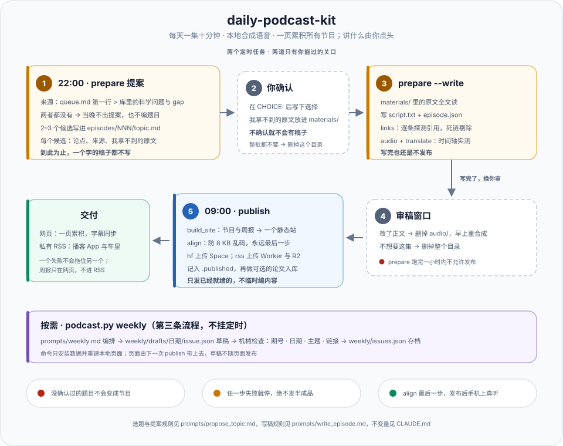

# 启动使用教程

从零到每天自动运行，按顺序做一遍。Windows 上的虚拟环境细节和 routine 的完整 prompt 在
`docs/WINDOWS.md`，这里只在需要时指过去。

## 0. 它是什么



每天一集十分钟的播客，有两个只有你能过的关口。

晚上 `prepare` 只出选题提案：2–3 个候选写进 `episodes/NNN/topic.md`，然后停下。你在 `CHOICE:`
后面写下选哪个，必要时把我抓不到的原文 PDF 放进 `materials/NNN/`；之后
`prepare --write` 才开始调研、写稿、核对引用、本地合成语音、翻译。早上 `publish` 生成网页、
传到 HuggingFace、确认能打开。写完稿到发布之间仍然是审稿窗口。

选题来源只有两级，取第一个可用的：

1. 你在 `prompts/queue.md` 里写的题目；
2. 知识库 KnowledgePalace 的科学问题与开放 gap。

两个都没有，当晚就不出提案，也不会自己编一个题目填空。

KnowledgePalace 只作为可选的文献检索、分析和论文 ingest 接口。明确选中且属于注册领域的库外论文可进入普通论文卡；节目、脚本、日报、周报和 podcast 项目不会写入知识库。没有 KnowledgePalace 时，podcast 仍可独立运行。

## 1. 一次性安装

1. **Python 虚拟环境**：仓库根目录下的 `.venv`，用 uv 建，按 `docs/WINDOWS.md` §1.1 装 torch 2.5.1、kokoro 等。
   下文在仓库目录里执行的 `python` 都指 `.venv\Scripts\python.exe`。
2. **claude 命令行**：选题写稿、翻译、知识库 ingest 都靠它。检查：

```bat
claude -p "reply with exactly: OK"
```

3. **KnowledgePalace**：`E:\OneDrive\Agentic AI\KnowledgePalace\.palace.toml` 已指向四个私有根目录，验证：

```bat
cd /d "E:\OneDrive\Agentic AI\KnowledgePalace"
python -m knowledge_palace.tools.config_resolver
```

打印出四个目录且无报错即可。

## 2. 配置 config.env

```bat
cd /d "E:\OneDrive\Agentic AI\daily-podcast-kit"
copy config.env.example config.env
```

`config.env` 是唯一的配置文件，在 gitignore 里，不要提交。逐项填：

| 变量 | 填什么 |
|---|---|
| `HF_TOKEN` | HuggingFace 的 **Write** token，见第 3 节 |
| `PODCAST_SPACE` | `你的HF用户名/daily-podcast`，后半段随意，Space 会自动创建 |
| `PODCAST_TITLE` / `PODCAST_AUTHOR` / `PODCAST_BLURB` | 页面上显示的节目名、作者、一句话简介 |
| `TRANSLATE_TO` | 要中文对照字幕就保留 `zh`，不要就留空 |
| `PALACE_DIR` | `../KnowledgePalace`，开启知识库联动；留空则不联动 |
| `RSS_BASE` / `RSS_UPLOAD_TOKEN` | 私有播客 RSS，可选，本教程不配，留空 |
| `KOKORO_EN_VOICE` / `KOKORO_DEVICE` | 语音和设备，默认即可 |
| `CLAUDE_MODEL` / `CLAUDE_EFFORT` | 写稿和周报用哪个模型；留空则用 `claude` 自己的默认设置 |

## 3. HuggingFace 同步

网页是整站传到**一个**静态 Space，所有集在同一页，地址永远不变。

### 3.1 拿 token

1. 登录 <https://huggingface.co>，右上角头像 → **Settings** → **Access Tokens** → **Create new token**。
2. 类型选 **Write**。Read 类型传不了文件，会报 `401`。
3. 复制 `hf_` 开头的字符串，它只显示一次。写进 `config.env` 的 `HF_TOKEN`。

token 泄露了就在同一页面点 **Invalidate**，重新生成一个换上。

### 3.2 Space 命名

`PODCAST_SPACE="用户名/daily-podcast"`。前半段必须是你的 HF 用户名或你有写权限的组织名。
**不要手动建 Space**：第一次发布时脚本自动创建，类型是 `static`。如果非要自己建，也必须选
Static，Gradio 和 Docker 类型需要付费账号，发布时报 `402 Payment Required`。

### 3.3 第一次发布

第 5 节手动跑通第一集之后，执行：

```bat
python scripts\podcast.py publish
```

输出里有三行地址：

| 行 | 是什么 |
|---|---|
| `SITE_URL=https://huggingface.co/spaces/用户名/daily-podcast` | Space 管理页：改可见性、看 Community 留言 |
| `SERVE_URL=https://用户名-daily-podcast.static.hf.space` | 听众打开的页面，发给别人的是这个 |
| `DISCUSS_URL=.../discussions` | Community 页，页面底部链到它 |

新建的 Space 要一分钟左右才能访问，脚本会自己轮询，看到 `Site serves HTTP 200` 才算成功。

### 3.4 手机上检查一次

用 iPhone 打开 `SERVE_URL`，点播放，确认时间在走、字幕跟着高亮。不能省：HuggingFace 的音频
链接有一个只在 iOS 上出现的问题，页面已绕过去，但只有手机能证明它还在绕。

### 3.5 公开还是私有

Space 默认公开。只想自己听：`SITE_URL` 页面 **Settings → Change space visibility → Private**，
之后打开 `SERVE_URL` 需要登录你的 HF 账号，手机浏览器登一次即可。
或者不走网页，走私有 RSS（`docs/PRIVATE_RSS.md`），订阅地址本身就是密码。

每个 Space 有一个 Community 标签，页面底部链到它；别人在那里点的题，可以直接加进 `queue.md`。

### 3.6 常见报错

| 报错 | 原因 |
|---|---|
| `KeyError: 'HF_TOKEN'` | `config.env` 不存在，或那一行是空的 |
| `401 Unauthorized` | token 是 Read 类型，或已被 Invalidate |
| `402 Payment Required` | Space 不是 static；删掉 Space 让脚本重建 |
| `Repository Not Found` | `PODCAST_SPACE` 前半段不是你的用户名 |
| `429 Too Many Requests` | 传得太频繁，等几分钟 |
| 页面里某个字变成 `�`，本地正常 | 8 KB 边界问题；`publish` 自动处理，手动发布时 `align` 必须最后一步 |
| iPhone 上转圈不播放，电脑正常 | `LESSONS.md` §1 |
| Windows 提示 symlink / Developer Mode | 脚本已关掉这个警告；模型照样能用 |

## 4. 选题控制：queue.md 和提案确认

- **`prompts/queue.md`**：一行一个题目，可以只写题目，也可以带你要的角度或一个文件路径。
  夜间任务取第一行，围绕它给 2–3 个角度。这一行要等你确认、并且稿子真的写出来之后才删掉，
  提案被你否掉不丢题。`#` 开头的行忽略。
- **队列空了**：配了 `PALACE_DIR` 时，从知识库的科学问题与开放 gap 里挑 2–3 个不同的问题做候选，
  每个候选顺带说明库里已经有什么。队列和知识库都没有，当晚不出提案。
- **确认**：提案在 `episodes\NNN\topic.md`。把候选编号（或你自己重写的题目）写在 `CHOICE:` 后面，
  再跑 `python scripts\podcast.py prepare --write`。不确认就不会有稿子；夜间任务再跑也只是把
  提案重新打印一遍提醒你。
- **材料**：提案会写明哪几篇原文我拿不到（AAAS/Science、`journals.ametsoc.org` 这类）。
  把 PDF 放进 `materials\NNN\`，写稿那一步会全文读，读不开会在节目里明说。
- **整批都不想要**：删掉整个 `episodes\NNN\` 目录，下次 `prepare` 重新提案。

## 5. 先手动跑一遍

先跑一次 `prepare` 出提案（用 `queue.md` 第一行的题目），确认之后再写稿，最后本地预览，不发布：

```bat
cd /d "E:\OneDrive\Agentic AI\daily-podcast-kit"
python scripts\podcast.py prepare
rem 打开 episodes\001\topic.md，在 CHOICE: 后面写下你的选择，需要的话把 PDF 放进 materials\001\
python scripts\podcast.py prepare --write
python scripts\build_site.py site
python scripts\podcast.py align site\index.html
python -m http.server 8123 --directory site
```

浏览器打开 <http://localhost:8123>。不要直接双击 `site\index.html`，大音频靠 fetch 加载，`file://`
下按钮没反应。`prepare` 的合成步骤会打印实际时长和按字数估算的时长，两者应接近。

本地正常后按第 3.3 节 `publish`，再按 3.4 节手机检查。

## 6. 每天的节奏

```
22:00  python scripts\podcast.py prepare           出 2–3 个候选写进 topic.md，停下
你      在 topic.md 的 CHOICE: 后写下选择            必要时把我拿不到的 PDF 放进 materials\NNN\
之后    python scripts\podcast.py prepare --write   写稿、核对引用、合成、翻译，仍不发布
09:00  python scripts\podcast.py publish           生成页面、上传、确认能打开，可选 ingest 选定论文
```

1. **晚上**看一眼 `logs\prepare_日期.log` 最后几行，应有 `=== PROPOSED: episode NNN`；
   读 `episodes\NNN\topic.md`，选一个填进 `CHOICE:`，然后跑 `prepare --write`，
   看到 `=== READY: episode NNN` 才算稿子做好了。
2. **早上 9 点前审稿**：`episodes\NNN\script.txt`。改了正文就删掉 `episodes\NNN\audio\`，早上会重新合成；
   不想要这集就删掉整个目录，早上只重发已有页面。
3. **发布**后 `logs\publish_日期.log` 里看两段：
   - `New episode ready: NNN` 和 `Site serves HTTP 200`；
   - 可选论文入库：`palace: ingesting N selected paper(s)` →
     `palace: ingested <slug...>; receipt saved in episode.json`。没有 `palace.ingest` 条目时会明确说明没有选定论文。
4. 想指定明天讲什么，就往 `queue.md` 加一行。

`publish` 发现 `prepare` 一小时内刚跑过会拒绝发布，这是防止电脑睡醒后把没人看过的稿子发出去；
审完稿子再 `publish --now`。

## 7. 文献周报

周报是按需跑的第三个命令，不在两个定时任务里：

```bat
python scripts\podcast.py weekly --topic "本周的研究主题"
python scripts\podcast.py weekly --draft weekly\drafts\2026-09-21\issue.json --date 2026-09-21 --audio
```

第一条让 agent 搜集、阅读、写出草稿，草稿落在 `weekly\drafts\日期\issue.json`；期号、日期、主题标签和
链接过了机械检查才写入 `weekly\issues.json`，往期保留。第二条是审阅之后的确定性安装，`--audio` 要求草稿
目录里另有 `script.txt`，走同一套 TTS 并把录音放到 `weekly\audio\`。`--days N` 改阅读覆盖天数，
`--skip-links` 在断网时跳过链接探测。

命令只安装数据和重建本地页面，不发布；页面由下一次 `publish` 带上去。草稿目录不会随页面发布。
字段含义和编辑规则见 `docs/WEEKLY.md`，编排规则见 `prompts/weekly.md`。

## 8. 挂成定时任务

`prepare` 挂 Windows 任务计划程序（准点、能唤醒电脑、错过即补），`publish` 挂 Claude 桌面版 routine（发布后在手机视口验证播放并汇报）。
命令和 routine 的完整 prompt 在 `docs/WINDOWS.md` §5。两个任务不要在两边重复挂。

## 9. 确认 KnowledgePalace 接口在工作

第一次真实运行后检查三处：

1. `episodes\NNN\episode.json` 里有 `topic_source` 和 `palace` 对象：
   `coverage`、`adds`、`differs`、`relates`、`ingest`。网页上对应 "Against the library" 一块。
2. 早上日志里有 `PALACE_INGEST_OK` 行（在 `palace: ingested` 之前，agent 打印的原文）。
3. podcast 自己的 `episode.json` 中有 `knowledge_palace_ingest` 回执；KnowledgePalace 中只增加或加深了普通论文卡，不应出现 `daily-podcast` 项目或 episode material。

可选 ingest 失败不影响已发布内容，重跑：

```bat
python scripts\podcast.py palace episodes\NNN
```

## 10. 排错

| 现象 | 看哪里 |
|---|---|
| `prepare` 说 `Nothing queued and no library configured` | 队列空且没配 `PALACE_DIR`，这是设计：当晚不出提案 |
| `prepare --write` 说 `CHOICE line ... is empty` | `topic.md` 里还没填选择，填完再跑 |
| `prepare` 又把提案打印一遍 | 上一份提案还没确认；确认它，或删掉那个 `episodes\NNN\` 目录 |
| `prepare` 日志里 agent 抱怨不能运行 python 命令 | 白名单只放行 `python -m knowledge_palace.interaction.research ...`；prompt 里的命令不要改 |
| `episode.json` 没有 `palace` 字段 | `config.env` 里 `PALACE_DIR` 没填，或 `.palace.toml` 解析失败，看 prepare 日志开头 |
| `optional palace ingest failed` | 看 `logs\publish_日期.log`，修好后用第 9 节的重跑命令 |
| ingest 跑了很久 | 每篇要真读，正常；它在发布之后运行，不拖慢上线 |
| 其他 Windows 问题 | `docs/WINDOWS.md` §8 |
